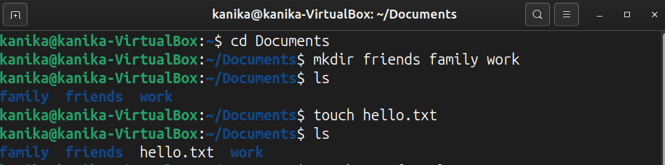
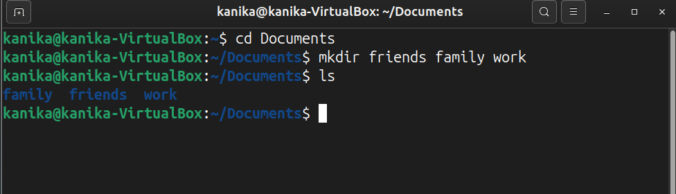
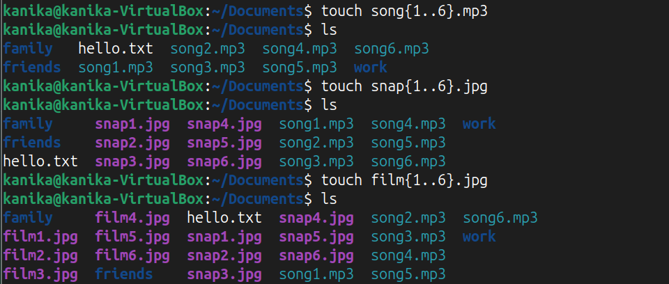
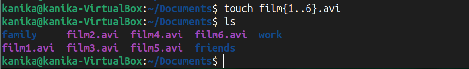

Use the touch command to create sets of empty practice files to use during this lab.

Create three subdirectories for organizing your files, and name thesubdirectories friends, family, and work. Use a single command to create all three subdirectories at the same time.
 

 Create six files with names of the form songX.mp3, snapX.jpg, filmX.avi

