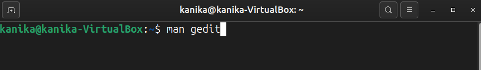
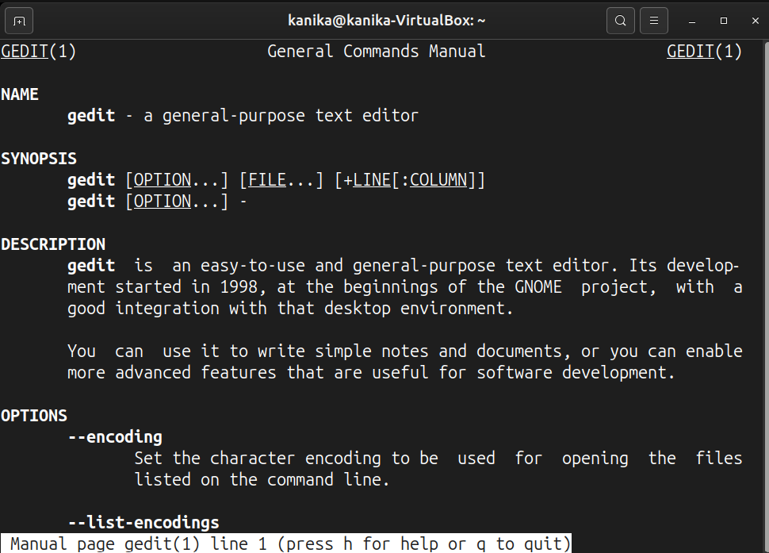
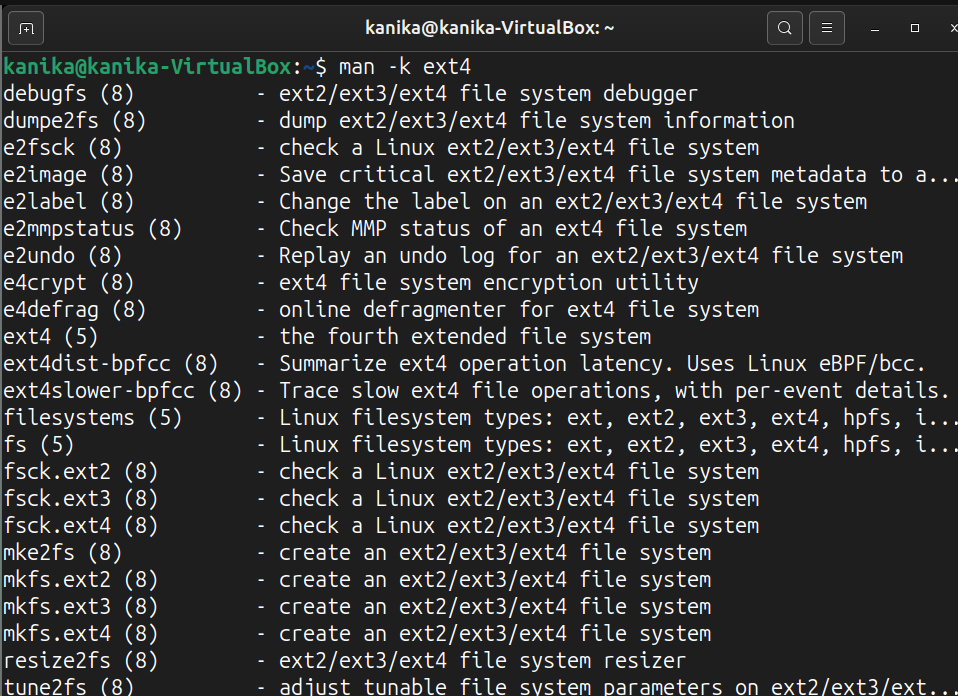
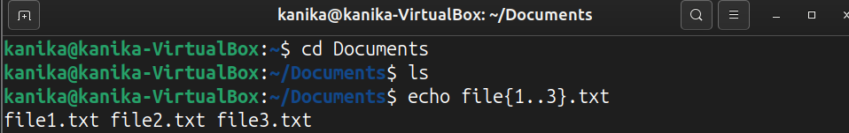
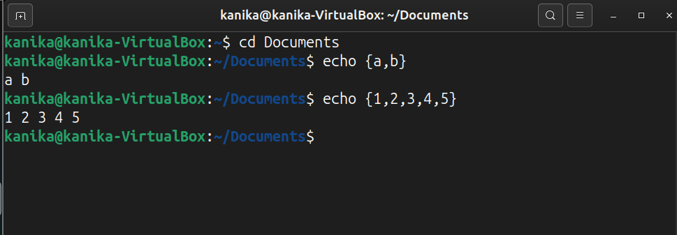
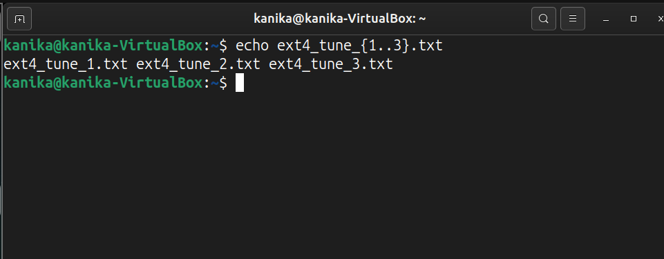

View the gedit man page. 

Use the man -k ext4 command to find the command to tune ext4 file-system parameters. 

Brace expansion is used to generate discretionary strings of characters. Braces contain a comma-separated list of strings, or a sequence expression.

